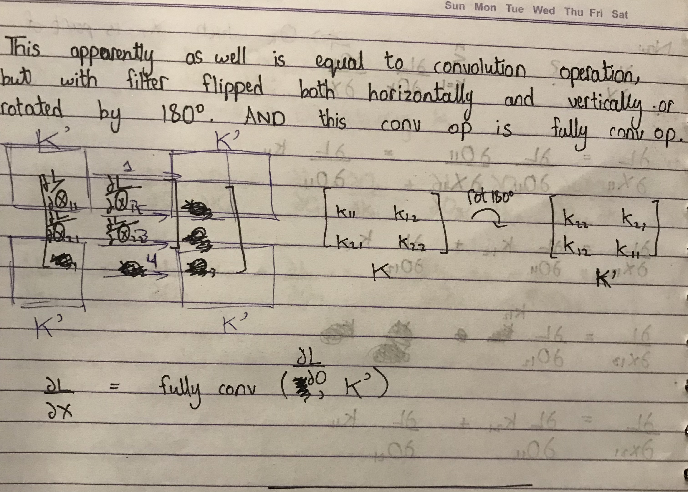

### CNNs `Convolution Neural Networks`
 

**General Notes on CNN**

- Biases in CNNs:
    - 2 Types of Bias
        - **Tied Biases: (A bias for each kernel)** if output channels are M then total biases will be M
        - **Untied Biases: (A bias for each output feature map cell)** if output feature map is CHW where C is number of output channels then total biases will be CHW in numbers. This means that number of biases are dependent on input size. Which is undesireable. However, this approach is said to work better.
    - The main purpose of bias is to shift values up and down for activation functions. Plus their utility is limited to shallow networks. Deep nets have insignificant impact by them.

- Back propagation of CNNs requires `Full Convolution` operation in which convolution is performed s.t. filter may go out-of-bounds. In other words, if feature-map is padded with `kernel_size-1` zeros on both axis and each side and then convolution is performed then the result would be equal to full convolution.

- The derivative of kernel $K$ w.r.t. Ouput loss $L$ is given by: Conv($X, \frac {dL} {dA}$) where $A=Conv(X, K)$ and $X$ is input feature map on which kernel $K$ is applied:
    - $ \frac {dL} {dK}=$ Conv($X, \frac {dL} {dA}$) 

- The derivative of input $X$ w.r.t. Ouput loss $L$ is given by: FullConv($ \frac {dL} {dA}, K'$) where $A=Conv(X, K)$ and $X$ is input feature map on which kernel $K$ is applied. And $K'$ is the kernel $K$ rotated $180$ degree or kernel flipped both horizontal and vertically:
    - $ \frac {dL} {dX}=$ FullConv($ \frac {dL} {dA}, K'$)
    - The flipping part is unintuitive but can be found to be the case by doing a simple example on paper. Following example shows derivation for both derivatives $\frac {dL} {dK}$ and $\frac {dL} {dX}$. In the images, $dA$ is represented with $dO$ everything else is same:
     
     
    
     
     
    
    

source: https://deeplearning.cs.cmu.edu/F21/document/recitation/Recitation5/CNN_Backprop_Recitation_5_F21.pdf

**Note: A confusion may arise from the fact that if there are more than one filters, wouldn't there derivative would be same and wouldn't they learn the same thing? No because each channel of output A is created by a different kernel.**

**Implementation Details**
    
- Gradients don't accumulate, like they don't in the implementation of Linear (Nueral Network) layer
- Kernel Size, Stride, Pad all are assumed to be same in both dimensions and are represented by integer
- I am using FCN (Fully Convolution Network), with only one output. However using hot encoding abd having 10 outputs with softmax at the end will be a better approach. 
- Layers are represented as sequence of 3 sub layers (conv, activation and pool). Each sub layer has a class to store relevant parameters for that layer like sizes and type. 