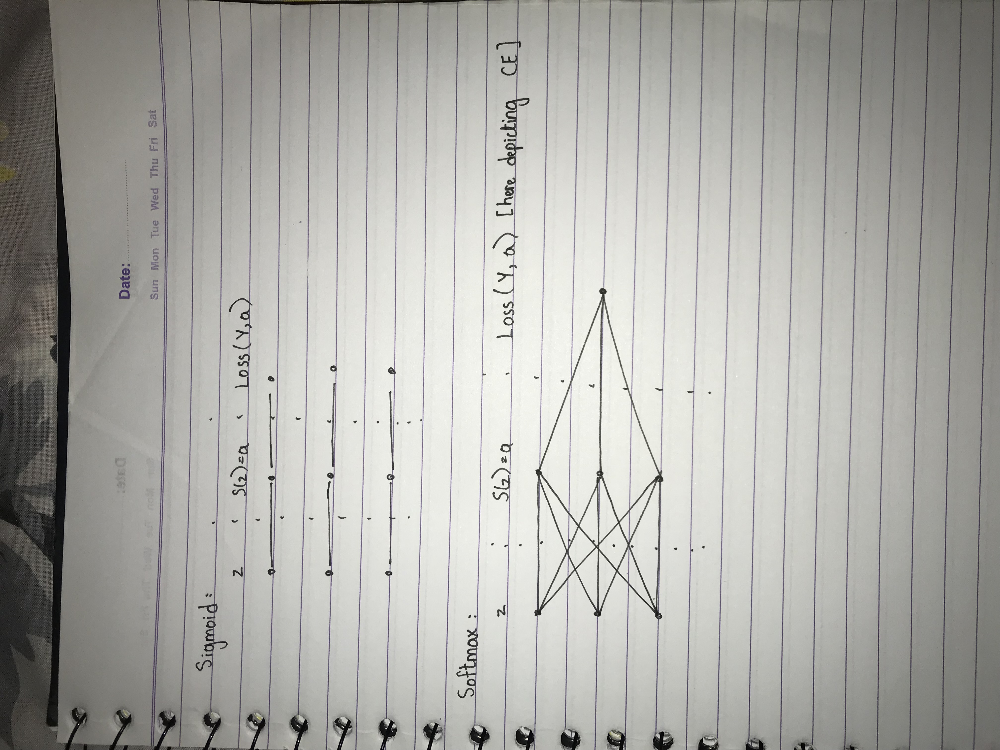
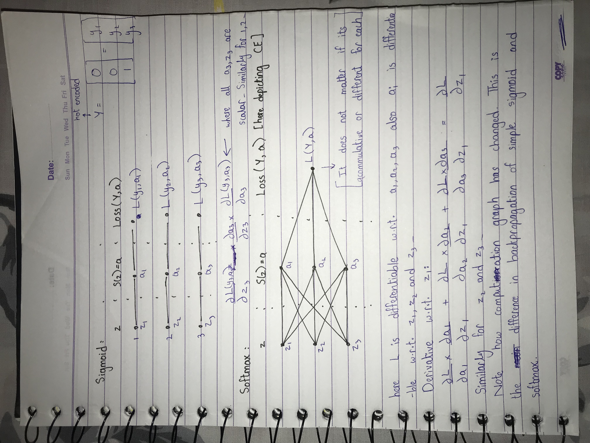

## Softmax Activations

- Formula: 

        Softmax(z_1) =  exp(z_1) / np.sum(elemenwise_exp(Z)), 

        where Z: {z_1, z_2, ... z_n} 

- exp(x) is positive for all values and increases exponentially as we move forward on real line. Since np.sum(Softmax(z_i) for all z_i in Z) = 1. These both things helps in penalizing the all wrong values where the one which is most wrong is penalized the most by a non-linear proportion while keeping total sum to 1. 

- In other words, if we had two values, 1 and 3 for z_1 and z_2 respectively. Simple average would penalize z_1 by 1/4 factor if it was wrong and penalize z_2 by 3/4 factor. But using exponents, z_2 will be penalized way more. But it still penalizes z_1 hence its called 'softmax' instead of hardmax.

- Softmax is generalized form of sigmoid (One could think of sigmoid as binary classifier as it operates on single input. Single variable can in theory represent two states on/off, 0/1. But this two states can be represented by using two variables as well. Indeed, but then they may or may not be mutually exclusive i.e. they may become on or off at the same time (not mutally exclusive) or they don't.) 

- Softmax by design is mutually exclusive i.e. there could be only one true value. This means to predict multi-labels from data we would require some other technique. But if sigmoid is used instead of softmax in the final layer, then it can predict mulitple labels as well. But this results in training each output seperately without any inter-relation. In Binary Cross Entropy Loss with Sigmoid (tag v1.2), since we have one input variable, we use BCE. Although both formula are mathematically equivalent for class count = 2 but direclty putting CE formula in implementation would result in network saturating at a=1 because loss will only be generated when y=1. 
    
    Formula: 

        BCE =  -(ylog(a)-(1-y)log(1-a))
        CE = -sum(ylog(a))

- So in nutshell, 
    - use CE with Softmax and BCE with Sigmoid, irrespective of the number of classes.
    - use some other technique than softmax if you want to predict multiple labels (classes) for a data item.

### Backpropagation of Softmax with CE

- The computation graph of the final layers of a network with softmax + CE (or any other loss function) is different from simple sigmoid + BCE:

 

 

- If we treat da/dz as a blackbox then rest of the network is same as before. 
- However from implementation prespective, if da/dz s are calculated at forward pass (like in my implementation), then they couldn't be simply added, because matching dL/da is not known at that time. So we need to resolve this at the time of backpropagation.
- With CE, only one of the Losses w.r.t ai will be non-zero which means that only one out of 3 terms shown in above expression dL/dz1 will be non-zero for any z in Z and any input. 